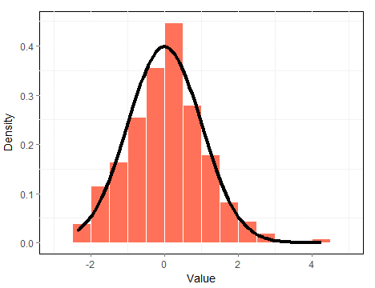

## The Central Limit Theorem (CLT)

The [**central limit theorem**](https://en.wikipedia.org/wiki/Central_limit_theorem) (CLT) states that the arithmetic mean of a sufficiently large number of iterates of independent and identically distributed (i.i.d.) random variables, each with a well-defined expected value and well-defined variance, will be approximately normally distributed, regardless of the underlying distribution. 

- The distribution of averages of iid variables (when properly normalized) becomes that of a standard normal with the sample size increases 
- That's to say, 
$$\frac{\bar X_n - \mu}{\sigma / \sqrt{n}}=
\frac{\sqrt n (\bar X_n - \mu)}{\sigma}
= \frac{\mbox{Estimate} - \mbox{Mean of estimate}}{\mbox{Std. Err. of estimate}}$$ 
has a distribution like that of a standard normal for large $n$ 
- Another way to think about the CLT is that 
$\bar X_n$ is approximately
$N(\mu, \sigma^2 / n)$ 

--- .class #id 

## CLT_app

To have a better understanding of the CLT, you can do some simple simulation examples with the [**CLT_app**](https://menghaoliu-pku.shinyapps.io/CLT_app) shiny app following the steps below: 

- Choose the **distribution type** of your random variable to be generated. 
- Specify some parameters of the selected distribution above, like mean and standard deviation for a normal distribution. 
- Assign the **sample size** and the **simulation number**. 
- Check the outputs in the two tabpanels named **Density plot** and **Summary table**. 
  - Density plot shows the standard normal distribution and the distribution of sample means, which substract off the population mean and devide by the standard error of the mean 
  - Summary table tells you how close the average/variance of the sample means with the theoretical mean/variance (devided by n) 

--- .class #id 

## Density Plot 

Let's move on to a simple example. Assuming you choose the Possion distribution and set the lambda value to 1, with the sample size 40 and simulation number 500, your are supposed to get a density plot like this: 



We can see the distribution of the normalized sample means is approximately nomal. 

--- .class #id 

## Summary Table

Considering the same example as the previous slide, the summary table will provide you something similar to the output below. 


```
##                                  Name Value
## 1             Average of sample means  1.01
## 2                    Theoretical mean  1.00
## 3            Variance of sample means  0.03
## 4 Theoretical variance (devided by n)  0.02
```

So, we can see the center of the sample means is very close to the population mean, and the variance of the sample means is also very close to the expected variance. 

Taken together, the [**CLT_app**](https://menghaoliu-pku.shinyapps.io/CLT_app) can indeed do some simple simulations, and I hope it will help some people who have difficulty with the understanding of CLT. 
